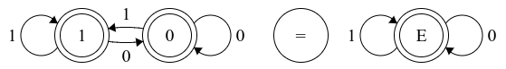
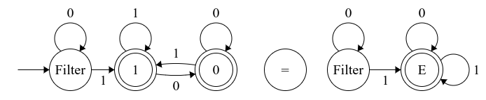
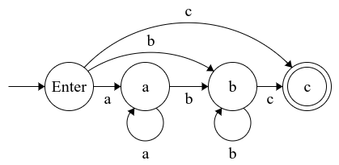
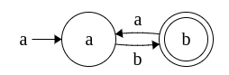
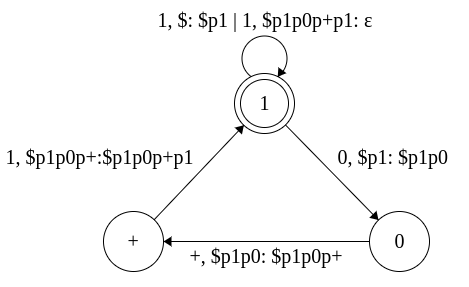
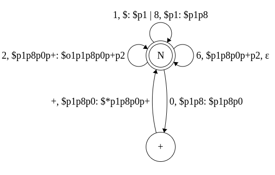
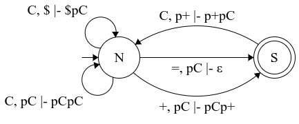

# TP 3 - Les Automates

## Automates Binaire

### Automates binaire simple



### Automates binaire sans bites non significatifs



## Morse


## ER

### a\*b\*c



### (ab)⁺



### c|(a⁺b\*)


## Automates à Pile

### Calcul 10+11

```Ocaml
Automate = (S, ∑, P, T, q0, $, F)

S = {1, 0, +}
∑ = {1,0,+}
P = {$,p0,p1,p+}
q0 = {1}
$ = {$}
F = {1}

T : {
   (1, 1, $) -> (1, $p1)
   (1, 0, $p1) -> (0, $p1p0)
   (0, +, $p1p0) -> (+, $p1p0p+)
   (+, 1, $p1p0p+) -> (1, $p1p0p+p1)
   (1, 1, $p1p0p+p1) -> (1,  ε)
}

Config = {
   (1,1,$) |- (1,  ε, $p1)
   (1, 0, $p1) |- (0,  ε, $p1p0)
   (0, +, $p1p0) |- (+,  ε, $p1p0p+)
   (+, 1, $p1p0p+) |- (1,  ε, $p1p0p+p1)
   (1, 1, $p1p0p+p1) |- (1,  ε) ~> Accepte
}
```



### Calcul addition binaire général.

```Ocaml
Automate = (S, ∑, P, T, q0, $, F)

S = {E, 1, 0, +}
∑ = {1}
P = {$,p0,p1,p+}
q0 = {E}
$ = {$}
F = {1}

T : {
   (E, 1, $) -> (1, $p1)
   (1, 1, p1) -> (1, p1p1)
   (1, 0, p1) -> (0, p1p0)
   (1, +, p1) -> (0, p1p+)
   (1, ε, pile) -> (E, ε)
   (0, 1, p0) -> (1, p0p1)
   (0, 0, p0) -> (0, p0p0)
   (0, ε, pile) -> (E, ε)
   (0, +, p0) -> (1, p0p+)
   (+, 0, p0) -> (0, p+p0)
   (+, 1, p+) -> (1, p+p1)
}

Config = {
   (E, 1, $) |- (1, ε, $p1)
   (E, 0, $) |- (1, ε, $p0)
   (1, 1, p1) |- (1, ε, p1p1)
   (1, 0, p1) |- (0, ε, p1p0)
   (1, +, p1) |- (0, ε, p1p+)
   (1, ε, pile) |- (E, ε, ε) ~> Accepte
   (0, 1, p0) |- (1, ε, p0p1)
   (0, 0, p0) |- (0, ε, p0p0)
   (0, ε, pile) |- (E, ε,  ε) ~> Accepte
   (0, +, p0) |- (1, ε, p0p+)
   (+, 0, p0) |- (0, ε, p+p0)
   (+, 1, p+) |- (1, ε, p+p1)
}
```


### Lecture 180+26

```Ocaml
Automate = (S, ∑, P, T, q0, $, F)

S = {N, +}
∑ = {1, 8, 0, 2, 6, +}
P = {$,p0,p1, p2, p8, p+}
q0 = {N}
$ = {$}
F = {N}

T : {
   (N, 1, $) -> (N, $p1)
   (N, 8, $p1) -> (N, $p1p8)
   (N, 0, $p1p8) -> (+, $p1p8p0)
   (+, +, $p1p8p0) -> (N, $p1p8p0p+)
   (N, 2, $p1p8p0p+) -> (N, $p1p8p0p+p2)
   (N, 6, $p1p8p0p+p2) -> (N,  ε)
}

Config = {
   (N, 1, $) |- (N,  ε, $p1)
   (N, 8, $p1) |- (N,  ε, $p1p8)
   (N, 0, $p1p8) |- (+,  ε, $p1p8p0)
   (+, +, $p1p8p0) |- (N,  ε, $p1p8p0p+)
   (N, 2, $p1p8p0p+) |- (N,  ε, $p1p8p0p+p2)
   (N, 6, $p1p8p0p+p2) |- (N,  ε) ~> Accepté
}
```



### Lecture 180+26=

```OCaml
Automate = (S, ∑, P, T, q0, $, F)

S = {N, S}
∑ = {1,8,0,+,2,6,=}
P = {$,p0,p1, p2, p6, p8, p+}
q0 = {N}
$ = {$}
F = {S}

T : {
   (N, 1, $) -> (N, $p1)
   (N, 8, $p1) -> (N, $p1p8)
   (N, 0, $p1p8) -> (S, $p1p8p0)
   (S, +, $p1p8p0) -> (N, $p1p8p0p+)
   (N, 2, $p1p8p0p+) -> (N, $p1p8p0p+p2)
   (N, 6, $p1p8p0p+p2) -> (S, $p1p8p0p+p2p6)
   (S, =, $p1p8p0p+p2p6) -> (S,  ε)
}

Config = {
   (N, 1, $) |- (N,  ε, $p1)
   (N, 8, $p1) |- (N,  ε, $p1p8)
   (N, 0, $p1p8) |- (+,  ε, $p1p8p0)
   (+, +, $p1p8p0) |- (N,  ε, $p1p8p0p+)
   (N, 2, $p1p8p0p+) |- (N,  ε, $p1p8p0p+p2)
   (N, 6, $p1p8p0p+p2) |- (N,  ε, $p1p8p0p+p2p6)
   (S, =, $p1p8p0p+p2p6) |- (S,  ε) ~> Accepte
}
```


### Lecture addition générale fin sur `=`

```OCaml
Automate = (S, ∑, P, T, q0, $, F)

S = {N, S}
∑ = {1,2,3,4,5,6,7,8,9,+,=}
P = {$,pC, p+}
q0 = {N}
$ = {$}
F = {S}

Soit C = {1,2,3,4,5,6,7,8,9}

T : {
   (N, C, $) -> (N, $pC)
   (N, +, pC) -> (S, pCp+)
   (N, =,pC) -> (N, ε)
   (S, C, p+) -> (N, p+pC)
}

Config = {
   (N, C, $) |- (N, ε, $pC)
   (N, +, pC) |- (S, ε, pCp+)
   (N, =,pC) |- (N, ε, ε)
   (S, C, p+) |- (N, ε, p+pC)
}
```

