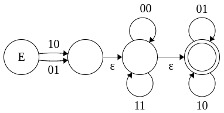
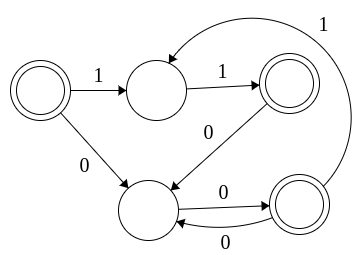
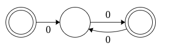
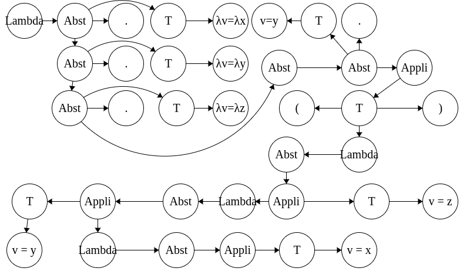

# Correction sujet 2

*temps correcteur : 40min*

## Exercice 1



## Exercice 2 

- Vrai car reconaissable par un automate déterministe



- Vrai car reconaissable par un automate déterministe



## Exercice 3

### Mots de L(G)

```
 S -> S S + -> S S + S + -> cte cte + cte +
 S -> cte
 S -> S S + -> S S x S + -> cte cte x cte + 
 S -> S S x -> S S + S x -> cte cte + cte x
 S -> S S x -> S S x S x -> cte cte x cte x
```

 ### Calcul longueur

 Pour une dérivation simple :
 ``` 
 S -> cte 
 |+| + |-| = 0 => |+| + |-| + 1 = 1
 |cte| = 1 
 Donc |+|+|*|+1=|cte|
```
 Par récurence, 

 Soit S une dérivation,

```
 S -> Sn cte + 
 ou
 S -> Sn cte x
```

 On suppose que la propriété est vérifier pour Sn. Donc
  ```
 Pour Sn, |+|_Sn+|x|_Sn+1=|cte|_Sn

 Pour S, soit |+|_S = |+|_Sn +1, soit |x|_S = |x|_Sn +1
 donc |x|_S+|+|_S+1 = |+|_Sn + |x|_Sn +1 + 1 = |cte|_Sn + 1  
 or d'après ma dérivation, |cte|_S = |cte|_Sn +1

 donc 
 |+|_S+|x|_S+1=|cte|_S
 ```

 La propriété est bien vérifier à S1 et est récursive, donc valable pour tt n. 

## Grammaire pour le lambda calcul

### Grammaire non ambiguë

Lambda -> Abst
Abst -> Appli | T.Abst
Appli -> LambdaT | T
T -> v | ( Lambda ) | 'lambda'v

### Derivation de 'lambda'x.'lambda'y.'lamda'z.y(x y z)



Non, l'arbre de dérivation est unique. La grammaire est donc bien non ambiguë.