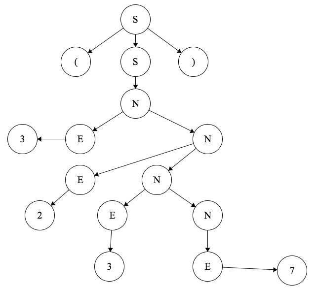
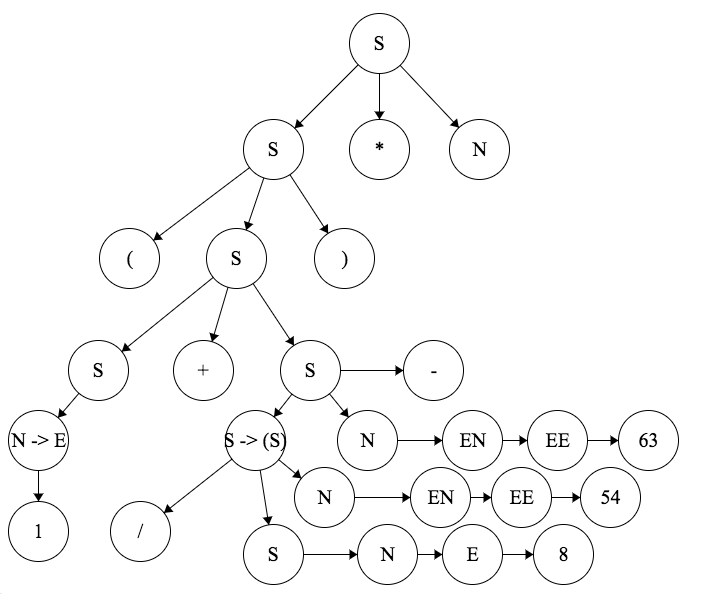
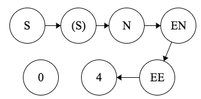
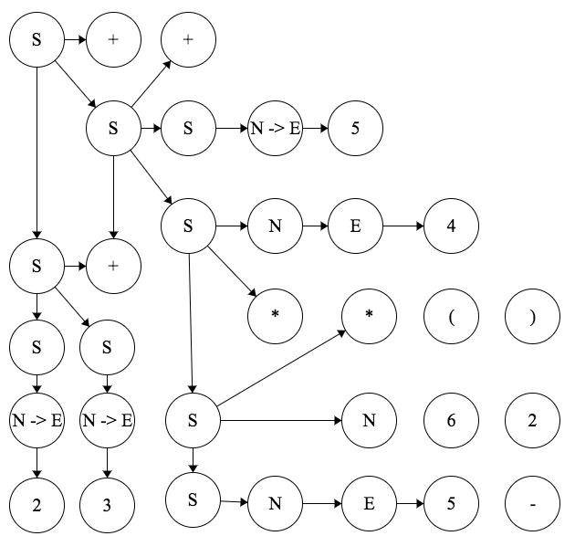

# Correction for Supinfo TP 1 2017

*difficulté: \*\*, temps correcteur: 15mins*

## Grammaire et Arbres (9 pts)

```OCaml
S->(S) | N | S * N | S – N | S + S | S / N
O-> = | * |;
N->E | EN
E->1 | 2 | 3 | 4 | 5 | 6 | 7 | 8 | 9
```

### Listez les terminaux, non terminaux, et l'axiome (2pts)

- terminaux: 1...9, *, -, +, /, (, ), =, ;
- non-terminaux: S, N, E, O
- axiome: S

### Construires les arbres d'analyse DESCENDANTE de L1 et L2 (3pts)

L1 = (3237) -> vrai

L2 = (1+(8/54)-63)*5 -> vrai


### Construires les arbres d'analyse ASCENDANTE de L3 et L4 (3pts)

L3 = (40) -> FAUX 0 n'est pas dans le vocabulaire

L4 = 2+3+5+4\*5\*(6-2) -> FAUX impossible d'avoir un terme en facteur `(X)` après un `*`.


### Est-elle ambigüe ???????? (1pts)

Non ambigüe. Pas de possibilité multiple de dérivation.

## Automates (6pts)

Vous disposez de l’alphabet Σ = {a, b, c} et de x, y et z des entiers positifs.

### Pour `x, y et z >= 0` et `x + z = y`, dessiner l’automate à pile reconnaissant l’expression `a^x b^y c^z`, avec toutes ses configurations

```OCaml
A = {S, Σ, P, T, q0, $, F}
S = {E, LA, LB, LC, S}
q0 = E
P = {$,p}
$ = $
Σ={a,b,c}
F={S}
T:
    (E,a,$) -> (LA,$p)
    (E,b,$) -> (LB, $p)
    (LA,a,p) -> (LA, pp)
    (LA,b,p) -> (LB, ε)
    (LB,b,$) -> (LB,$p)
    (LB,b,p) -> (LB,ε)
    (LB,c,p) -> (LC,ε)
    (LC,c,p) -> (LC,ε)
    (LC,c,$) -> (S,ε)
    (S,ε,ε)

Config:
    (E,a,$) |- (LA,ε,$p)
    (E,b,$) |- (LB,ε, $p)
    (LA,a,p) |- (LA,ε, pp)
    (LA,b,p) |- (LB,ε, ε)
    (LB,b,$) |- (LB,ε,$p)
    (LB,b,p) |- (LB,ε,ε)
    (LB,c,p) |- (LC,ε,ε)
    (LC,c,p) |- (LC,ε,ε)
    (LC,c,$) |- (S,ε,ε) ~> Accepté
```

## Regex (5pts GRATUITS)

### Les phrases suivantes sont-elles générées par l'expression regulière `(a | b)*(c | d | b)+`

- M1 = cccadde -> Faux (a doit être avant c, e n'appartient pas au vocabulaire)
- M2 = ababaabadddcbbb -> Vrai
- M3 = bbbbbaaacbbbbccddabbbb -> Faux (a doit être avant c)
- M4 = a -> Faux (au moins un b ou d ou c doit être présent)
- M5 = bb -> Vrai
- M6 = c -> Vrai
